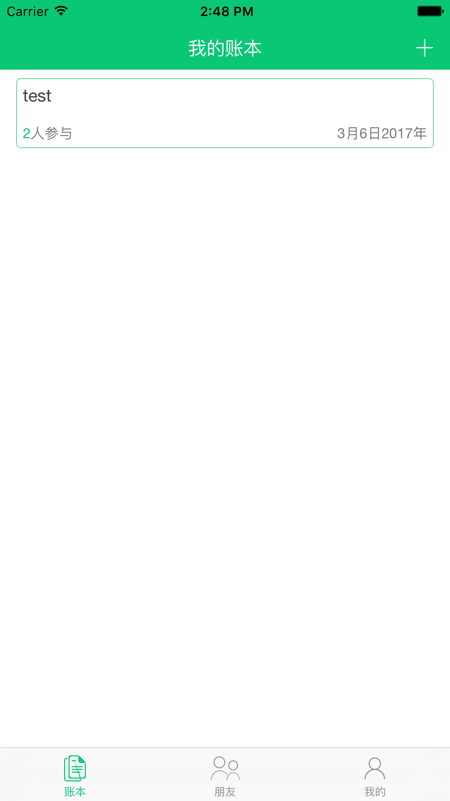
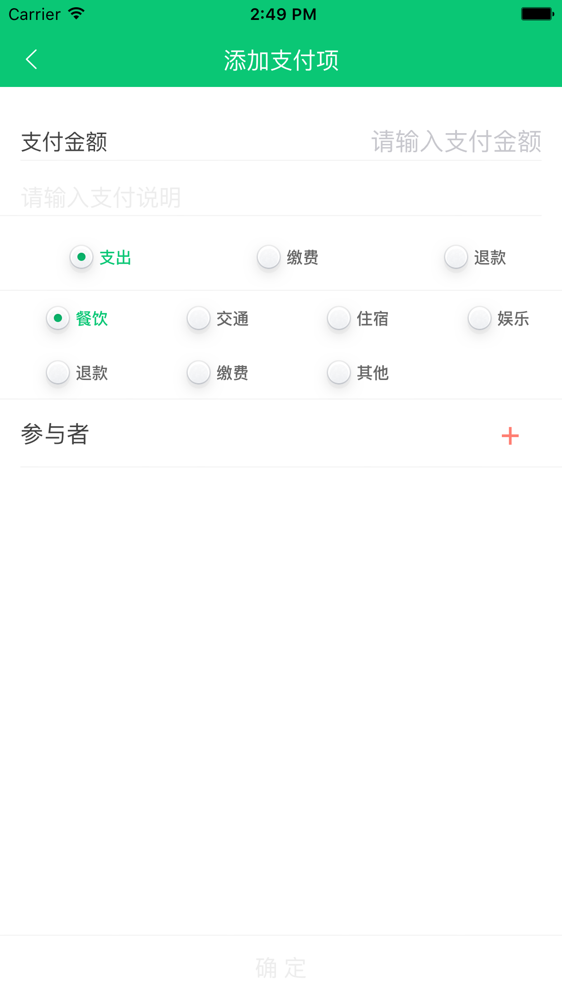
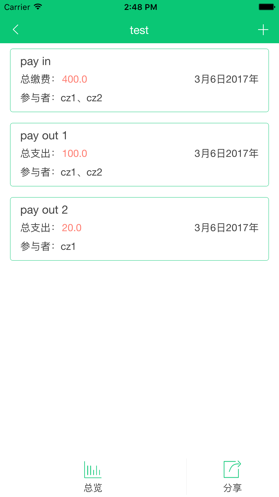
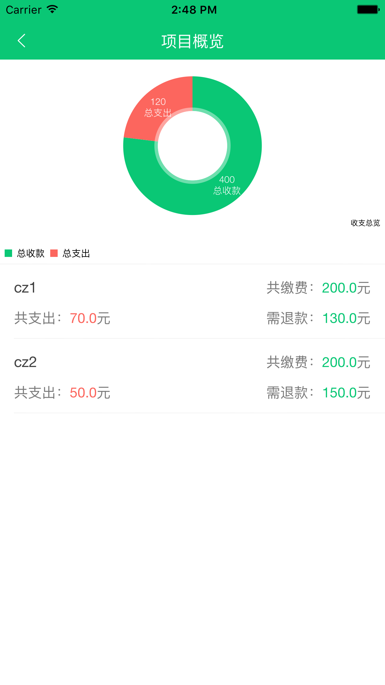

# AAshare
This is a completed finance app with Swift 3 And Nodejs. 

The purpose i write it is i'm try to be a fullstack developer.

The ScreenShot as below

### iOS
Swift 3 + Realm + RxSwift + Alamofire

The project use Carthage as packmanager, please execute 'carthage update'  before run

### Server Side
The project use npm && MongoDB, please make sure you install it all before run

### Contact Me
email: funpig@hotmail.com

QQ: 550462 (pls comments: github)

### Reference
[CNode](https://cnodejs.org)

### Licence
MIT

